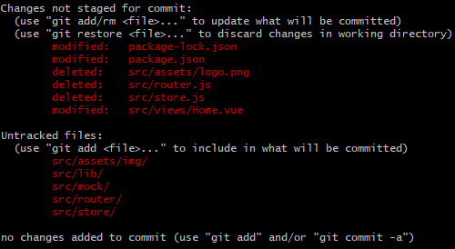

# vue-cli3

## Project setup
```
npm install
```

### Compiles and hot-reloads for development
```
npm run serve
```

### Compiles and minifies for production
```
npm run build
```

### Run your tests
```
npm run test
```

### Lints and fixes files
```
npm run lint
```

### Customize configuration
See [Configuration Reference](https://cli.vuejs.org/config/).
date: 2019/9/18

### 调整项目结构


### 完善vue.config.js配置文件
该文件中，有的是开发环境需要的配置，有的是生产环境需要的配置，vue-cli3将他们参杂在一起配置了
